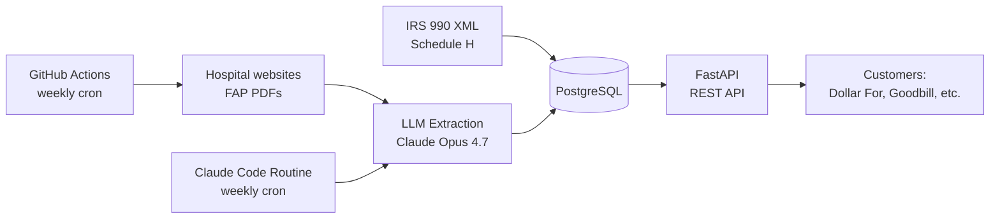

# FAP-DATABASE

**A self-updating REST API for nonprofit hospital Financial Assistance Policy data in the Philadelphia metro area.**

Built for charity-care advocacy organizations and patient-facing healthcare tools that need structured, current FAP information without scraping it themselves.

> **Status:** Pre-launch / research preview. Schema and API surface may change before v1.0. Not yet recommended for production use. See [Roadmap](#roadmap).

---

## What this is

Every nonprofit hospital in the United States is required by IRS §501(r) to publish a Financial Assistance Policy (FAP) — the document that defines who qualifies for free or discounted care, how to apply, and what the hospital's billing and collections practices are. These policies are the backbone of how uninsured and underinsured patients access affordable care.

In practice, FAP data is fragmented across thousands of hospital websites, buried in 20-page PDFs, and changes without notice. Organizations like [Dollar For](https://dollarfor.org/) and [Goodbill](https://goodbill.com/) spend significant engineering and operations time keeping up with it.

FAP-DATABASE is a focused alternative: a structured, queryable database of FAP information for the Philadelphia metro area, with provenance tracking, change detection, and a stable REST API. The dataset is built primarily from **IRS Form 990 Schedule H** — the structured data hospitals are already required to file — and supplemented with **LLM-extracted fields from the published FAP PDFs** for the long tail of details Schedule H doesn't capture.

---

## Why Philadelphia

The Philadelphia metro has roughly 30 nonprofit hospitals across several major systems (Penn Medicine, Jefferson, Temple, CHOP, Main Line Health, Trinity Health Mid-Atlantic, and others), making it a tractable scope for a high-quality v1 dataset. Pennsylvania is also one of the states with stronger charity-care advocacy presence, which makes the work practically useful while the technical approach matures.

The architecture is region-agnostic. Expanding to other metros is a matter of seed data and operational capacity, not a rewrite.

---

## Who this is for

- **Patient advocacy organizations** (Dollar For, RIP Medical Debt's adjacent tooling, hospital-billing nonprofits) that triage applications and need to know each hospital's eligibility rules and required documents.
- **Healthcare cost-transparency tools** (Goodbill and similar) that show patients what they should be paying and what they may qualify to have written off.
- **Researchers and journalists** studying charity-care provision, since the dataset includes historical Schedule H filings going back to a hospital's first 990 with Schedule H data.
- **Patients and caseworkers**, indirectly, through the products built on top of this API.

This is not a consumer-facing tool. It is infrastructure for the people who build consumer-facing tools.

---

## What you get

A REST API that exposes, for each Philadelphia-area nonprofit hospital:

- **Identity:** Name, system, address, EIN, NPI, CCN
- **Eligibility:** Federal Poverty Level thresholds for free care vs. discounted care, asset tests, residency requirements, insurance-status criteria
- **Income tiers:** Sliding-scale discount tiers when the hospital publishes them (e.g., 200% FPL → free, 200–400% FPL → 75% discount)
- **Application details:** How to apply (online portal, fax, email, mail), required documents, application window, look-back period, whether third parties can submit on a patient's behalf
- **Billing & collections:** Summary of the hospital's billing/collections policy, list of extraordinary collection actions (ECAs) the hospital has stated it may take
- **Source documents:** Direct links to the current FAP, plain-language summary, application form, and billing/collections policy, with content hashes and last-verified timestamps
- **Provenance:** Every field is tagged with where it came from (IRS Schedule H XML, LLM extraction from the FAP PDF, or manual entry), the model and prompt version used, and the extraction date
- **Change history:** Audit log of every detected change to a hospital's documents or extracted fields, queryable by date

See the [API reference](#api-reference) below or the live OpenAPI docs at `/docs`.

---

## How it works



Two ingestion paths feed the same database:

**Path 1 — IRS Schedule H (primary).** Nonprofit hospitals file Form 990 with Schedule H annually. Schedule H Part V Section B contains structured fields for FAP eligibility criteria: FPL thresholds, asset tests, residency requirements, application methods, and more. The IRS publishes these filings as XML on AWS. We parse them directly. No LLM, no scraping ambiguity, no hallucination risk for the fields the IRS already collects.

**Path 2 — FAP document extraction (supplement).** For fields Schedule H doesn't capture — specific dollar discount tiers, fax numbers, the exact list of required documents, billing/collections policy language — we download the hospital's published FAP PDF, hash it, and extract structured fields using Claude Opus 4.7 with tool-use forcing for schema compliance.

When the two sources cover the same field and disagree, **Schedule H wins**. It's IRS-attested. The disagreement is logged for review.

Self-updating happens in two scheduled jobs:

- A **GitHub Actions workflow** runs weekly, downloads the current FAP documents for every seeded hospital, computes content hashes, and queues any changed documents for re-extraction.
- A **Claude Code Routine** runs an hour later, processes the queue, runs LLM extraction on changed documents, writes results to the database, and posts a summary.

The split is deliberate: deterministic work runs in cheap, reliable CI; AI-judgment work runs on Anthropic's managed infrastructure where it has better observability and your laptop doesn't need to be on.

---

## Data sources

| Source | What it provides | License |
|---|---|---|
| IRS Form 990 XML (AWS-hosted) | Structured Schedule H data, hospital identifiers | Public domain |
| Hospital-published FAP PDFs | Full policy text, application forms, plain-language summaries | Required to be publicly posted under IRS §501(r) |
| IRS Exempt Organizations Business Master File | EIN-to-organization metadata for seed list | Public domain |
| CMS Provider of Services file | CCN-to-hospital crosswalk | Public domain |

All source data is public. The dataset built from it is released under [the same license as the code](#license).

---

## Quickstart

### Run locally with Docker

```bash
git clone https://github.com/YOUR-ORG/FAP-DATABASE.git
cd FAP-DATABASE
cp .env.example .env
# Edit .env to add your ANTHROPIC_API_KEY

docker compose up -d              # Postgres on :5433
pip install -e ".[dev]"
alembic upgrade head              # Create schema
python -m fap_database.ingest.seed_philly      # Load seed hospitals
python -m fap_database.ingest.irs_990 --all    # Pull Schedule H data
python -m fap_database.ingest.fap_scraper --all # Download FAP PDFs
uvicorn fap_database.api.main:app --reload
```

Visit `http://localhost:8000/docs` for the interactive API reference.

### Try a query

```bash
# List all Philadelphia nonprofit hospitals
curl http://localhost:8000/v1/hospitals?city=Philadelphia \
  -H "X-API-Key: $API_KEY"

# Get a specific hospital's current FAP
curl http://localhost:8000/v1/hospitals/{hospital_id}/fap \
  -H "X-API-Key: $API_KEY"

# See what's changed for a hospital in the last 90 days
curl "http://localhost:8000/v1/hospitals/{hospital_id}/changes?since=2026-01-28" \
  -H "X-API-Key: $API_KEY"
```

---

## API reference

Authentication is via `X-API-Key` header. Request a key by [opening an issue](https://github.com/YOUR-ORG/FAP-DATABASE/issues) (during research preview) or contacting the maintainer.

| Endpoint | Description |
|---|---|
| `GET /health` | Service health, DB connectivity, version |
| `GET /v1/hospitals` | List hospitals; filter by `city`, `state`, `has_fap`; paginated |
| `GET /v1/hospitals/{hospital_id}` | Full hospital record with most recent Schedule H summary |
| `GET /v1/hospitals/{hospital_id}/fap` | Current FAP — eligibility, income tiers, application details, required documents, with provenance |
| `GET /v1/hospitals/{hospital_id}/documents` | All FAP-related documents with hashes and currency flags |
| `GET /v1/hospitals/{hospital_id}/changes?since=YYYY-MM-DD` | Audit log of detected changes |
| `GET /v1/hospitals/lookup?ein=&npi=&ccn=&name=` | Flexible identity lookup |
| `GET /v1/hospitals/city/{city}` | All hospitals in a city |

Full OpenAPI spec at `/docs`. Response schemas, field-level descriptions, and example responses live there — they are part of the contract, not an afterthought.

---

## Provenance and trust

Every field returned by the API includes a provenance tag. A provenance block looks like:

```json
{
  "fpg_free_care_threshold_pct": 200,
  "_provenance": {
    "fpg_free_care_threshold_pct": {
      "source": "schedule_h_xml",
      "source_url": "https://s3.amazonaws.com/irs-form-990/...xml",
      "tax_year": 2023,
      "verified_at": "2026-04-22T09:14:00Z"
    }
  }
}
```

For LLM-extracted fields, the provenance block additionally records the model identifier, prompt version, and the SHA-256 hash of the source document. This means downstream users can reproduce extractions, audit the data lineage, and decide for themselves how much to trust each field.

---

## Limitations and disclaimers

**Read this before building anything that depends on this data.**

- This dataset is **informational, not legal or clinical advice**. Eligibility decisions belong to hospitals, not third parties.
- A hospital's posted FAP is what they say their policy is. What their billing office actually does in practice can differ. The data here reflects the former.
- IRS Schedule H data lags actual filings by several months. For the most recent fiscal year, the LLM-extracted PDF data may be the only available source until the 990 is processed.
- LLM extractions can be wrong. Critical fields (FPL thresholds, asset thresholds) are reconciled with Schedule H wherever possible, and disagreements are flagged. But for fields with no Schedule H counterpart (specific tier discount percentages, required documents lists), users should verify against the source PDF when stakes are high.
- The seed list is currently manually curated for the Philadelphia metro. Coverage is approximately 25–30 hospitals across Philadelphia and inner-ring suburbs. We do not yet automatically discover new hospitals or handle hospital closures and mergers.
- Scanned (image-only) FAP PDFs are not currently OCR'd. They are flagged for manual review in the change log. This affects a small number of hospitals.
- We respect `robots.txt` and rate-limit document fetches. If a hospital's site blocks us, that hospital's PDF data may go stale.

**Patients in need of charity care should not use this API directly.** This is infrastructure. Use [Dollar For](https://dollarfor.org/), your hospital's financial counseling office, or a hospital social worker.

---

## Roadmap

**v0.x — Philadelphia research preview** (current)
- 25–30 manually-curated Philadelphia-area hospitals
- Schedule H ingestion + PDF extraction + reconciliation
- Stable read API with provenance and change tracking
- Weekly auto-update via GitHub Actions + Claude Code Routine

**v1.0 — Production-ready Philadelphia**
- API authentication via per-customer keys with rate limits
- SLA on data freshness and uptime
- Documented API stability guarantees (semver on the schema)
- OCR support for scanned FAPs

**v2.0 — Regional expansion**
- Mid-Atlantic metros (DC, Baltimore, NYC)
- Automated hospital discovery from IRS BMF + state licensure data
- Webhook notifications for FAP changes

**Not on the roadmap, by design:**
- Patient eligibility determinations (regulatory minefield, not our place)
- PHI of any kind
- Hospital outreach automation (not what this is)

---

## Contributing

This is early-stage work. The most useful contributions right now:

1. **Verifying the seed hospital list.** If you know the Philadelphia hospital landscape, open an issue if anything is missing or wrong.
2. **Spot-checking extractions.** Pick a hospital, compare the API response to the source PDF, file an issue for any discrepancy.
3. **Schedule H parser edge cases.** The IRS schema has evolved across years; if you find a tax year that parses incorrectly, attach the XML and the expected output.

For larger contributions, please open an issue first to discuss direction. The architecture decisions are documented in `PROJECT_SPECS.md` and the decision log there.

---

## License

Code: MIT.

Dataset: The data in this repository and served by the API derives entirely from public-domain IRS filings and publicly-posted hospital documents required to be public under IRS §501(r). The compilation is released under [CC BY 4.0](https://creativecommons.org/licenses/by/4.0/) — use it for anything, including commercial products, with attribution.

---

## Acknowledgments

This project exists because of work by [Dollar For](https://dollarfor.org/), the [Hilltop Institute](https://www.hilltopinstitute.org/), [Community Benefit Insight](https://www.communitybenefitinsight.org/), and the patient-advocacy and health-services-research communities that have pushed for charity-care transparency for years. This API is a small piece of infrastructure on top of their work.

---

*Maintained by [your name]. Questions: [your email]. Bug reports: [issues](https://github.com/YOUR-ORG/FAP-DATABASE/issues).*
